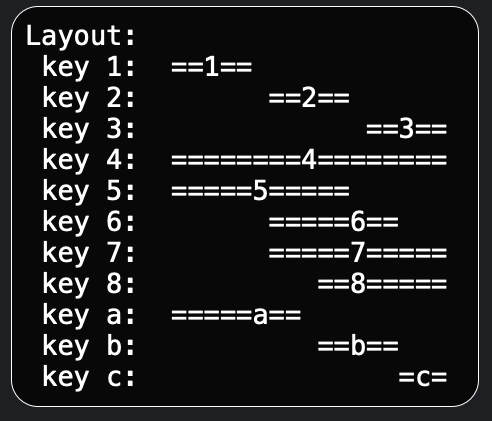

# Hammerspoon 

## Functions

This are my collection of my Hammerspoon Scripts

### [WindowAxHotfix](/Helpers/Extensions/WindowAxHotfix.lua)

Hotfix for weird window behaviour during animation. Just include the patch into your `init.lua`:

````lua
require("Helpers.Extensions.WindowAxHotfix")
````

See problem description and example code fix:
  - https://github.com/Hammerspoon/hammerspoon/issues/3224#issuecomment-2155567633
 - https://github.com/Hammerspoon/hammerspoon/issues/3277


### [MailMateFocus](/Functions/MailMateFocus.lua)

I don't like it when MailMate switches the focus to Chrome when I click on a link. This script changes the focus back to MailMate if it detects a click in MailMate before the focus switches to Chrome. You can modify the behavior of the script by enabling `enable_cmdClick` to only observe cmd+click events.

### [DisableCmdW](/Functions/DisableCmdW.lua)

This disable the shortcut `cmd+w` at the main screen of MailMate and WhatsApp so it not closes the MailMate main window.
It uses my helper `bindHotkey(toAppAndTab(mailmateName,"essages%)$")` (see below).

### [MacZoom](/Functions/MacZoom.lua)

Enabling the original MacZoom to my Hyper key would be a better shortcut for my hand. I have set my Hyper key to the `fn` key and the `cmd_right` key.

Shortcuts:
- hyper + 0 -> Zoom In/Zoom out
- hyper + - -> Decrease Zoom
- hyper + + -> Increase Zoom

### [PlayerGlobalControl](/Functions/PlayerGlobalControl.lua)

This feature enables the user to control a media player with a standardized set of keyboard shortcuts, regardless of whether the player is the currently active application or not. 

This is particularly useful when working on a tutorial or coding in an IDE, where the user may need to switch between the player and the IDE frequently. But with this there is no need to switch the focus to chrome because it sends commands via JXA to chrome and no switch is needed.

Set the focus to a specific window with hyper + o - then it switches also between tabs when you have a localhost open (currently it sends JXA to the current active tab when you not set the focus).

This feature currently supports controlling the IINA and Chrome media players, as well as providing special shortcuts for certain websites.


Shortcuts:

- hyper + u -> Start (see note 1)
- hyper + p -> Play/Pause
- hyper + k -> Reset Speed
- hyper + l -> Decrease Speed
- hyper + ; -> Increase Speed
- hyper + 9 -> Max 16x Speed or press adskip button (see note 2)
- hyper + ' -> Jump Backward
- hyper + \ -> Jump Forward
- hyper + j -> Max Quality (1080)  (see Note 3)

> Note 1: on some places it needs this special start: on youtube when you use a plugin which autostop the playing (YouTube™ No Buffer - Stop Auto-playing 0.4.6), or in Udemy to start a section) - see it as the start as a first command. If you click on youtube page on links to other videos which not complete refresh the page: then you need manualy refresh the page to have the play button detected.

> Note 2: the button click not works out of the box - you need install some Chrome Plugin so that it works again (
YouTube Ad Auto-skipper
2.2.0)

> Note 3: currently not used so much, because I can set this with a Chrome TamperMonkey Script: [Nova YouTube (Plugin for TamperMonkey)](https://github.com/raingart/Nova-YouTube-extension)

Supported Apps:
- [IINA](https://iina.io/)
- Google Chrome

Shortcuts available for this websites:
- Gerneric Video (mostly this works)
- https://youtube.com (disabled - I now use GenericVideo)
- https://twitch.tv
- https://udemy.com
- https://wdr.de
- https://ardmediathek.de
- https://ardaudiothek.de
- https://spiegel.de
- https://spotify.com/
- https://tvnow.de (no speed controls)
- https://joyn.de (no speed controls)

### [ResizeChildWindows](/Functions/ResizeChildWindows.lua)

Resize all child windows of an app to the current shild's window size. This command will adjust the size of all child windows within an application to match the dimensions of the active child window.

Shortcuts:
- hyper + r -> Resize all child windows


### [WindowPlacer](/Functions/WindowPlacer.lua)

This functionality allows the user to move windows to pre-defined locations on either their MacBook or an external monitor in portrait orientation. Specifically, there are three designated locations: the upper half of the monitor (designated as hyper+1), the lower half of the monitor (designated as hyper+2), and the MacBook itself (designated as hyper+3). By using this feature, users can more quickly and easily arrange their windows to best suit their workflow and preferences. The Modal mode allow also place the windows in different columns.

Shortcuts:
- hyper + 1 -> External Monitor Top
- hyper + 2 -> External Monitor Bottom
- hyper + 3 -> Main Monitor
- hyper + 4 -> External Monitor FullScreen
- hyper + 8 -> External Monitor 2/3 screen
- hyper + w -> Modal Mode for different placements on big monitor (see screenshot)



### [MultiDisplayBlack](/Functions/MultiDisplayBlack.lua)

Switch display to black.

Shortcuts:
- hyper + 5 -> toggle other display black
- hyper + 6 -> toggle all displays black
 
### [AudioSwitcher](/Functions/AudioSwitcher.lua)

Select audio out device

Shortcuts:
- hyper + 7 -> open audio out device selector
- 
### [hs_select_window](/Spoons/hs_select_window/init.lua)

Select child windows

Shortcuts:
- opt + g -> open all child window selector
- opt + shift + g -> open current app child window selector

### [MenuBarChooser](/Functions/MenuBarChooser.lua)

Select an icon in the macOS menu bar. Also find hidden icons.

List all apps:


Filter apps:


Select for docker app:


Clicked the docker menu bar item:


Shortcuts:
- hyper + b

### [AppBorders](/Functions/AppBorders.lua)

Draw a red border around the current active app.

### [ChromeNewWindow](/Functions/ChromeNewWindow.lua)

This feature enables users to open a new Chrome window with the same size as an existing window. However, it is important to note that users may need to customize the menu command to match their current language settings. If anyone is interested in contributing to a language-independent solution, they are welcome to submit a pull request. One potential solution could be to search all menus for the keyboard shortcut `cmd+N` (as is done in [KSheet](/Spoons/KSheet.spoon/init.lua)).

### [ChromeTabCopyLink](/Functions/ChromeTabCopyLink.lua)

With this it is fast to copy the current title and link as markdown text.

Shortcut:
- hyper + c -> Copy ChromeTab URL

### [ChromeTabToNewWindow](/Functions/ChromeTabToNewWindow.lua)

This feature allows the user to detach the current tab from a browser window and move it into a new window. Please note that users may need to customize the menu command to match their current language settings. For those interested in contributing to a language-independent solution, pull requests are welcome. One possible solution could be to search all menus for specific keywords (similar to the approach used in [KSheet](/Spoons/KSheet.spoon/init.lua), although the exact keywords would need to be determined).

Shortcuts:
- hyper + t -> show current tab in new window

### [ChromeTabAudioActive](/Functions/ChromeTabAudioActivate.lua)

WIP: I try to activate the first tab of an audio playing tab - not working :/

### [ChromeTabDomainCounter](/Functions/ChromeTabDomainCounter.lua)

Count the open tld sort by most used - output in the console:

```shell
2024-12-02 06:45:49: Starting to fetch URLs from Google Chrome...
2024-12-02 06:45:49: -- Loading extension: osascript
2024-12-02 06:45:53: Successfully fetched URLs from Chrome.
2024-12-02 06:45:53: Processing URLs...
2024-12-02 06:45:53: Final TLD Counts:
2024-12-02 06:45:53: github.com: 137
2024-12-02 06:45:53: google.com: 73
2024-12-02 06:45:53: youtube.com: 48
2024-12-02 06:45:53: x.com: 33
2024-12-02 06:45:53: computerbase.de: 22
2024-12-02 06:45:53: reddit.com: 19
2024-12-02 06:45:53: spiegel.de: 16
2024-12-02 06:45:53: home-assistant.io: 14
2024-12-02 06:45:53: amazon.de: 13
```

Note to me: I should close more tabs.

### [DateString](/Functions/DateString.lua)

This feature allows the user to insert the current date in the format `yyyy-mm-dd`:

Shortcuts:
- hyper + d -> insert current date

### [HighLight](/Functions/Highlight.lua)

This feature allows the user to  highlight current mouse position

Shortcuts:
- hyper + g -> highlight current mouse position
- hyper + h -> highlight current app

### [Umlauts.lua](/Functions/Umlauts.lua)

- Mapping german umlauts to `opt`+`key` are in:
```lua
local umlauts = {
    -- note: leave the space before ä Ä - otherwise it not work
    { 'a', ' ä', ' Ä' },
    { 'o', 'ö', 'Ö' },
    { 'u', 'ü', 'Ü' },
    { 'e', '€', '€' },
}

```

## Tools & Spoons

### EmmyLua.spoon

- i added Timestamps to speed up and skip unchanged files
- interesting when you use IntelliJ IDEA to show complettions
- NOTE: load this spoon before other an reload watcher to avoid reloads while this spoon writes the annotation files

## Helpers

### [ErrorCatcher](/Helpers/ErrorCatcher.lua)

This helper catches errors and prints them to the console. It is useful for debugging purposes, as it allows you to see the source of an error when it is crashing your script.

### [BindHotkey only to some apps](/Helpers/SendKeysOnlyInApp.lua)

If you like to have hotkeys only in some apps or exclude some apps from your global hotkeys, then the helper `bindHotkey` help you.

#### Syntax

`bindHotkey(AppCondition, modifier, key, message, function)`

- where `AppCondition` := 
  - `to(apps)` | 
  - `exclude(apps)` | 
  - `toAppAndTab(appName,tabPattern)` | 
  - `toAppsAndTabs({appName,tabPattern},{appName,tabPattern})` | 
  - `excludeAppAndTab(appName,tabPattern)` | 
  - `excludeAppsAndTabs({appName,tabPattern},{appName,tabPattern})` | 
  - `any(condition...)` | 
  - `none(condition...)` 

- and where:
  - `apps` := can be a list of string parameters or a table of string
  - `appName` := string
  - `tabPattern` := pattern to match a tab
  
Examples:

```lua
  bindHotkey(to("Google Chrome","code"), modifier, key, message, function)
  bindHotkey(to({"Google Chrome","code"}), modifier, key, message, function)
  
  bindHotkey(exclude("Google Chrome"), modifier, key, message, function)
  bindHotkey(exclude("Google Chrome","whatsapp"), modifier, key, message, function)
  
  bindHotkey(to("Google Chrome","IntelliJ IDEA"), {"cmd"}, "n", "info", myFunction)
  bindHotkey(exclude("Google Chrome","IntelliJ IDEA"), {"cmd"}, "n", "info", myFunction)
  
  bindHotkey(toAppAndTab("MailMate","essages%)$"), {"cmd"}, "n", "info", myFunction)
  bindHotkey(toAppsAndTabs({"MailMate", "essages%)$"}, {"WhatsApp", "pattern"}), {"cmd"}, "n", "info", myFunction)
  bindHotkey(any(toAppAndTab("MailMate", "essages%)$"), toAppAndTab("WhatsApp", "pattern")), {"cmd"}, "n", "info", myFunction)
  
  bindHotkey(excludeAppAndTab("MailMate","essages%)$"), {"cmd"}, "n", "info", myFunction)
  bindHotkey(excludeAppsAndTabs({"MailMate","essages%)$"},{"WhatsApp", "pattern"}), {"cmd"}, "n", "info", myFunction)
  bindHotkey(none(excludeAppAndTab("MailMate","essages%)$",excludeAppAndTab("WhatsApp", "pattern")), {"cmd"}, "n", "info", myFunction)
```

for patterns see:
https://www.lua.org/manual/5.1/manual.html#5.4.1

### HotKeySheet.spoon

replacement for `hs.hotkey.showHotkeys`

if you add a scriptname to the description then it is grouped by scriptname. Example: `MaximizeApp: Maximize App`


### DebugFunction

- [debugFunction](/Helpers/DebugFunction.lua) show source code of a function in console

for example:
```lua
debugFunction(hs.hotkey.getHotkeys)
```

console output:

```text
2022-11-19 11:28:29: Source: @/Applications/Hammerspoon.app/Contents/Resources/extensions/hs/hotkey.lua:357-370

function hotkey.getHotkeys()
  local t={}
  for _,hks in pairs(hotkeys) do
    for i=#hks,1,-1 do
      if hks[i].enabled and hks[i]~=helpHotkey then
        t[#t+1] = hks[i]
        break
      end
    end
  end
  tsort(t,function(a,b)if#a.idx==#b.idx then return a.idx<b.idx else return #a.idx<#b.idx end end)
  if helpHotkey then tinsert(t,1,helpHotkey) end
  return t
end
```