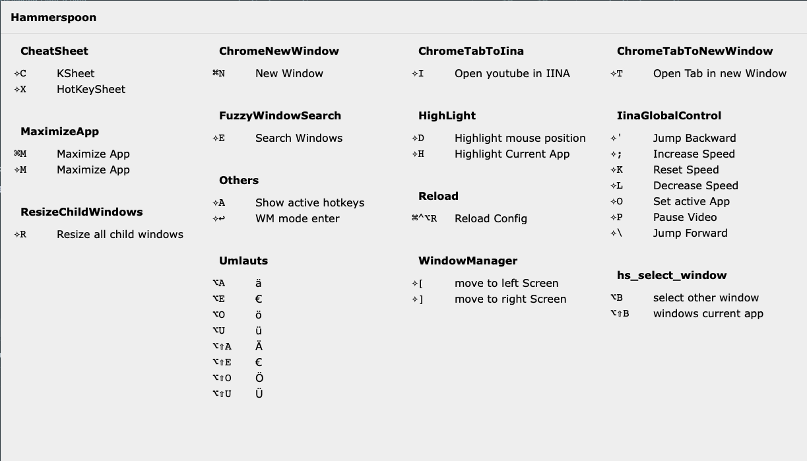

# Hammerspoon 

This are my collection of my Hammerspoon Scripts

### [MailMateFocus](/Functions/MailMateFocus.lua)

I don't like it when MailMate switches the focus to Chrome when I click on a link. This script changes the focus back to MailMate if it detects a click in MailMate before the focus switches to Chrome. You can modify the behavior of the script by enabling `enable_cmdClick` to only observe cmd+click events.

### [MailMateDisableCmdW](/Functions/MailMateDisableCmdW.lua)

This disable the shortcut `cmd+w` at the main screen of MailMate so it not closes the MailMate main window.
It uses my helper `bindHotkey(toAppAndTab(mailmateName,"essages%)$")` (see below).

### [MacZoom](/Functions/MacZoom.lua)

Enabling the original MacZoom to my Hyper key would be a better shortcut for my hand. I have set my Hyper key to the `fn` key and the `cmd_right` key.

Shortcuts:
- hyper + 0 -> Zoom In/Zoom out
- hyper + - -> Decrease Zoom
- hyper + + -> Increase Zoom

### [PlayerGlobalControl](/Functions/PlayerGlobalControl.lua)

This feature enables the user to control a media player with a standardized set of keyboard shortcuts, regardless of whether the player is the currently active application or not. This is particularly useful when working on a tutorial or coding in an IDE, where the user may need to switch between the player and the IDE frequently. This feature currently supports controlling the IINA and Chrome media players, as well as providing special shortcuts for certain websites.

Shortcuts:

- hyper + p -> Pause
- hyper + k -> Reset Speed
- hyper + l -> Decrease Speed
- hyper + ; -> Increase Speed
- hyper + ' -> Jump Backward
- hyper + \ -> Jump Forward

Supported Apps:
- [IINA](https://iina.io/)
- Google Chrome

Shortcuts available for this websites:
- https://youtube.com
- https://twitch.tv
- https://udemy.com
- https://wdr.de
- https://spiegel.de
- https://tvnow.de (no speed controls)
- https://joyn.de (no speed controls)

### [ResizeChildWindows](/Functions/ResizeChildWindows.lua)

Resize all child windows of an app to the current shild's window size. This command will adjust the size of all child windows within an application to match the dimensions of the active child window.

Shortcuts:
- hyper + r -> Resize all child windows


### [WindowPlacer](/Functions/WindowPlacer.lua)

This functionality allows the user to move windows to pre-defined locations on either their MacBook or an external monitor in portrait orientation. Specifically, there are three designated locations: the upper half of the monitor (designated as hyper+1), the lower half of the monitor (designated as hyper+2), and the MacBook itself (designated as hyper+3). By using this feature, users can more quickly and easily arrange their windows to best suit their workflow and preferences.

Shortcuts:
- hyper + 1 -> External Monitor Top
- hyper + 2 -> External Monitor Bottom
- hyper + 3 -> Main Monitor

### [AppBorders](/Functions/AppBorders.lua)

Draw a red border around the current active app.

### [ChromeNewWindow](/Functions/ChromeNewWindow.lua)

This feature enables users to open a new Chrome window with the same size as an existing window. However, it is important to note that users may need to customize the menu command to match their current language settings. If anyone is interested in contributing to a language-independent solution, they are welcome to submit a pull request. One potential solution could be to search all menus for the keyboard shortcut `cmd+N` (as is done in [KSheet](/Spoons/KSheet.spoon/init.lua)).

### [ChromeTabToNewWindow](/Functions/ChromeTabToNewWindow.lua)

This feature allows the user to detach the current tab from a browser window and move it into a new window. Please note that users may need to customize the menu command to match their current language settings. For those interested in contributing to a language-independent solution, pull requests are welcome. One possible solution could be to search all menus for specific keywords (similar to the approach used in [KSheet](/Spoons/KSheet.spoon/init.lua), although the exact keywords would need to be determined).

Shortcuts:
- hyper + t -> show current tab in new window

### [Umlauts.lua](/Functions/Umlauts.lua)

- Mapping german umlauts to `opt`+`key` are in:
```lua
local umlauts = {
    -- note: leave the space before ä Ä - otherwise it not work
    { 'a', ' ä', ' Ä' },
    { 'o', 'ö', 'Ö' },
    { 'u', 'ü', 'Ü' },
    { 'e', '€', '€' },
}

```

### EmmyLua.spoon

- i added Timestamps to speed up and skip unchanged files
- interesting when you use IntelliJ IDEA to show complettions
- NOTE: load this spoon before other an reload watcher to avoid reloads while this spoon writes the annotation files

### [BindHotkey only to some apps](/Helpers/SendKeysOnlyInApp.lua)

If you like to have hotkeys only in some apps or exclude some apps from your global hotkeys, then the helper `bindHotkey` help you.

#### Syntax

`bindHotkey(AppCondition, modifier, key, function)`

- where `AppCondition` := `to(apps)` | `exclude(apps)` | `toAppAndTab(appName,tabPattern)` | `excludeAppAndTab(appName,tabPattern)`

- and where:
  - `apps` := can be a list of string parameters or a table of string
  - `appName` := string
  - `tabPattern` := pattern to match a tab
  
Examples:

```lua
bindHotkey(to("Google Chrome","code"), modifier, key, function)
bindHotkey(to({"Google Chrome","code"}), modifier, key, function)

bindHotkey(exclude("Google Chrome"), modifier, key, function)
bindHotkey(exclude("Google Chrome","WhatsApp"), modifier, key, function)

bindHotkey(to("Google Chrome","IntelliJ IDEA"), {"cmd"}, "n", nil, myFunction)
bindHotkey(exclude("Google Chrome","IntelliJ IDEA"), {"cmd"}, "n", nil, myFunction)

bindHotkey(toAppAndTab("MailMate","essages%)$"), {"cmd"}, "n", nil, myFunction)
bindHotkey(excludeAppAndTab("MailMate","^%d Tabs"), {"cmd"}, "n", nil, myFunction)

```

for patterns see:
https://www.lua.org/manual/5.1/manual.html#5.4.1

### HotKeySheet.spoon

replacement for `hs.hotkey.showHotkeys`

if you add a scriptname to the description then it is grouped by scriptname. Example: `MaximizeApp: Maximize App`




### DebugFunction

- [debugFunction](/Helpers/DebugFunction.lua) show source code of a function in console

for example:
```lua
debugFunction(hs.hotkey.getHotkeys)
```

console output:

```text
2022-11-19 11:28:29: Source: @/Applications/Hammerspoon.app/Contents/Resources/extensions/hs/hotkey.lua:357-370

function hotkey.getHotkeys()
  local t={}
  for _,hks in pairs(hotkeys) do
    for i=#hks,1,-1 do
      if hks[i].enabled and hks[i]~=helpHotkey then
        t[#t+1] = hks[i]
        break
      end
    end
  end
  tsort(t,function(a,b)if#a.idx==#b.idx then return a.idx<b.idx else return #a.idx<#b.idx end end)
  if helpHotkey then tinsert(t,1,helpHotkey) end
  return t
end
```